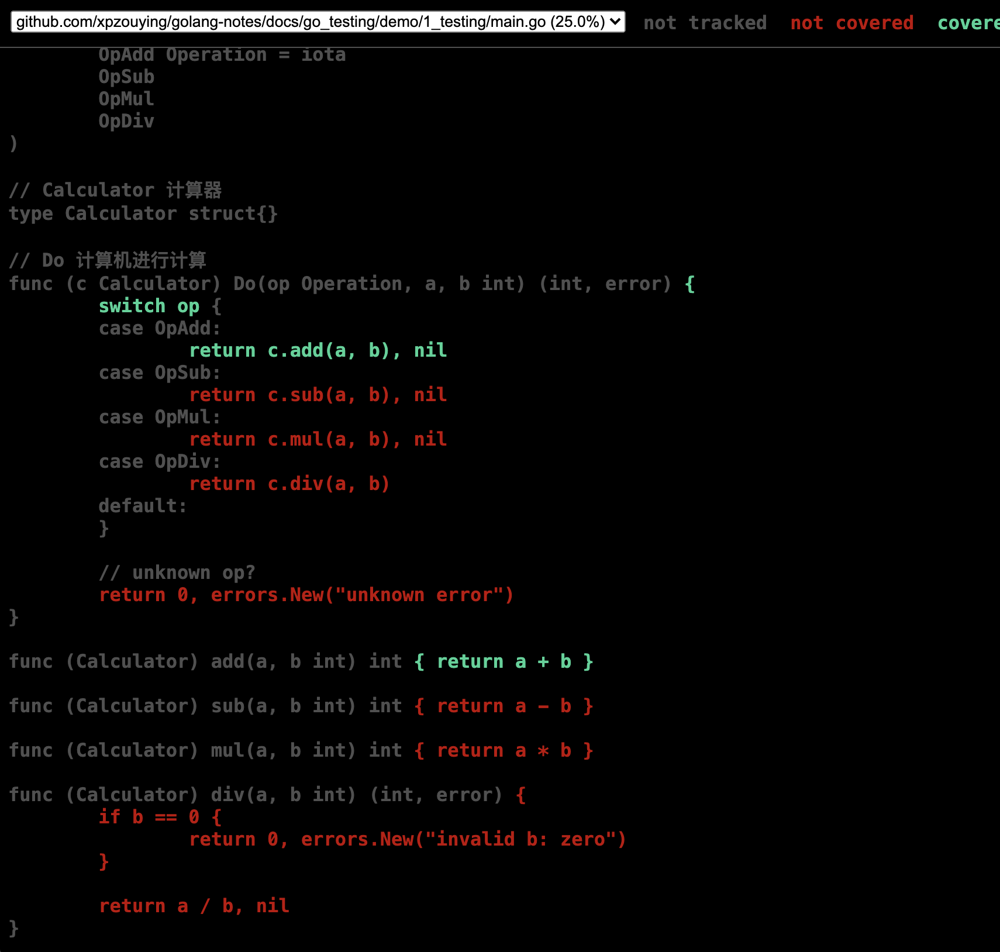
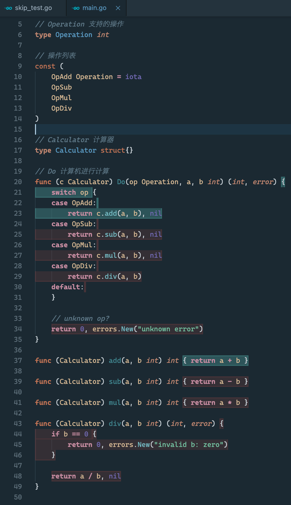
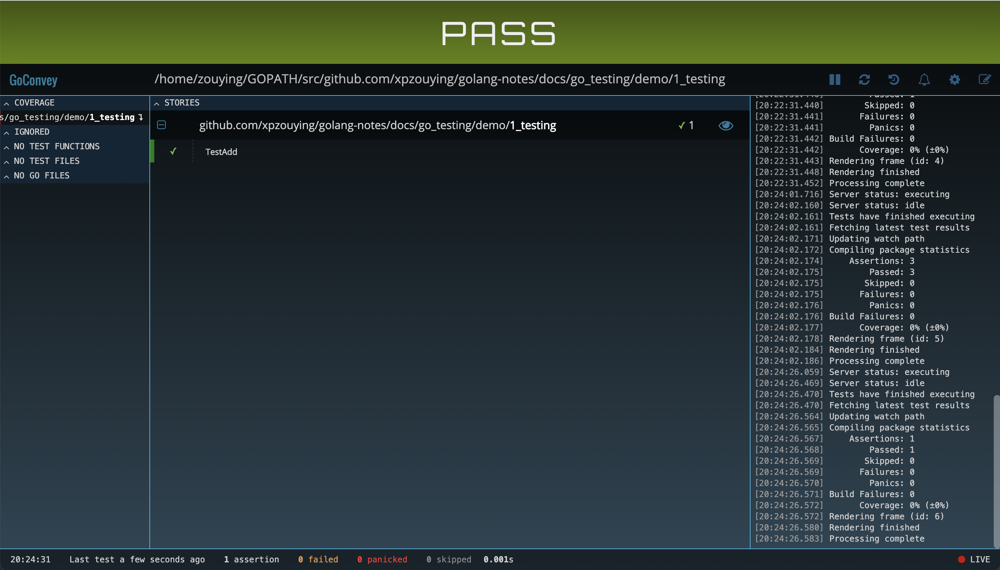

# Golang测试

本章节介绍在Golang中如何进行测试。

## 1、单元测试

以一个计算器示例demo。

计算器支持4种操作，加减乘除。

```go
// Operation 支持的操作
type Operation int

// 操作列表
const (
	OpAdd Operation = iota
	OpSub
	OpMul
	OpDiv
)

// Calculator 计算器
type Calculator struct{}

// Do 计算机进行计算
func (c Calculator) Do(op Operation, a, b int) (int, error) {
	switch op {
	case OpAdd:
		return c.add(a, b), nil
	case OpSub:
		return c.sub(a, b), nil
	case OpMul:
		return c.mul(a, b), nil
	case OpDiv:
		return c.div(a, b)
	default:
	}

	// unknown op?
	return 0, errors.New("unknown error")
}

func (Calculator) add(a, b int) int { return a + b }

func (Calculator) sub(a, b int) int { return a - b }

func (Calculator) mul(a, b int) int { return a * b }

func (Calculator) div(a, b int) (int, error) {
	if b == 0 {
		return 0, errors.New("invalid b: zero")
	}

	return a / b, nil
}
```

暂时不考虑溢出的情况。围绕该计算器编写响应的测试用例代码。


### 1.1、单元测试用例

**测试用例的规则为：**

测试文件以`*_test.go`命名，与正常的代码文件放在同一个package里面。

Xxx不能以小写字母开头。

```go
func TestXxx(*testing.T)
```

**测试用例**

```go
func TestAdd(t *testing.T) {
	c := Calculator{}

	a, b := 1, 2
	op := OpAdd

	res, err := c.Do(op, a, b)
	if err != nil {
		t.Errorf("do error: %v", err)
	}

	want := 3
	if res != want {
		t.Errorf("calculater error: a=%d,b=%d,res=%d,want=%d", a, b, res, want)
	}
}
```


### 1.2、运行单元测试

运行测试用例。

```bash
go test

go test -v .

go test -v -run="TestAdd"
# 与上面一样
go test -v -run="Add"
```

### 1.3、单元测试覆盖

`go test -cover`查看当前的测试用例覆盖。

```bash
go test -cover
```

```
➜  1_testing (go-testing) ✗ go test -cover       
PASS
coverage: 25.0% of statements
ok      github.com/xpzouying/golang-notes/docs/go_testing/demo/1_testing        0.002s
```

**手动生成**

1、生成profile数据文件：使用`-coverprofile`。

```bash
➜  1_testing (go-testing) ✗ go test -coverprofile=coverage.out
PASS
coverage: 25.0% of statements
ok      github.com/xpzouying/golang-notes/docs/go_testing/demo/1_testing        0.002s
```

2、转换为html文件：使用`-html`。

```bash
➜  1_testing (go-testing) ✗ go tool cover -html=coverage.out  
HTML output written to /tmp/cover018342743/coverage.html
```




**使用vscode查看覆盖**

MacOS下按快捷键：`command+shift+P`，搜索命令：`go cover`或`go: toggle test coverage`。




### 1.4、增加更多的单元测试

**使用TDD模式**

安装goconvey工具。

```bash
go get github.com/smartystreets/goconvey

# 启动服务，默认监听在:8080端口
goconvey
```




**增加更多的测试用例**

重复大量的代码，覆盖各种边界值，特殊条件等等。

**使用表格法：table-driven**

使用表格法，可以避免重复的业务逻辑代码，更加关注测试数据和异常边界值。

```go
func TestAllInOneTable(t *testing.T) {
	ts := []struct {
		Op      Operation
		A       int
		B       int
		WantRes int
		WantErr error
	}{
		{Op: OpAdd, A: 1, B: 2, WantRes: 3, WantErr: nil},
		{Op: OpSub, A: 5, B: 3, WantRes: 2, WantErr: nil},
		{Op: OpMul, A: 5, B: 3, WantRes: 15, WantErr: nil},
		{Op: OpDiv, A: 15, B: 3, WantRes: 5, WantErr: nil},
		{Op: OpDiv, A: 15, B: 0, WantRes: 0, WantErr: ErrInvalidB},
	}

	c := Calculator{}

	for _, tc := range ts {
		a, b := tc.A, tc.B
		op := tc.Op
		want := tc.WantRes

		res, err := c.Do(op, a, b)
		if err != tc.WantErr {
			t.Errorf("do error: %v", err)
			continue
		}

		if res != want {
			t.Errorf("calculater error: a=%d,b=%d,res=%d,want=%d", a, b, res, want)
		}
	}
}
```


## 2、压测

### 2.1、压测用例


```go
func BenchmarkXxx(*testing.B)
```

### 2.2、运行压测

使用`-bench` flag标识压测。

```bash
go test -bench
```

### 2.3、压测作用

- 调优

- 资源竞争


## 3、测试技巧

### 3.1、表格测试法

### 3.2、Mockup测试

### 3.3、跳过单元测试

测试中，可以使用`Skip`跳过当前的测试用例。

可以在某些环境不满足的情况时，跳过某些测试。

```bash
t.Skip()

b.Skip()
```

demo代码：`3_more_testing/skip_test.go`

```go
func TestSkipTestcase(t *testing.T) {
	t.Skip("skip this testcase")

	t.Logf("at the end of function")
}
```

运行测试用例，可以看到测试是被SKIP。

```
➜  3_more_testing (go-testing) ✗ go test -v .
=== RUN   TestSkipTestcase
    skip_test.go:6: skip this testcase
--- SKIP: TestSkipTestcase (0.00s)
PASS
ok      github.com/xpzouying/golang-notes/docs/go_testing/demo/3_more_testing   0.002s
```


## 参考资料

- [Go Testing](https://golang.org/pkg/testing/)
- [Go By Example: Testing](https://gobyexample.com/testing)
- [golang cover](https://blog.golang.org/cover)
- [GoConvey TDD工具](http://goconvey.co/)