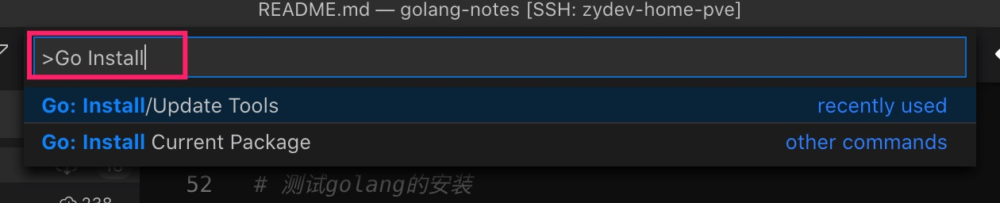

# Golang入门

通过这篇文章，可以方便初学者对Golang有个快速的了解。

本文中章节的内容都分为2部分：

1. 简单手把手的操作；
2. 推荐深入看的一些资料；


## 1、安装

**1.1、安装Golang**

以Linux为例，

```bash
# 下载
wget https://golang.org/dl/go1.15.3.src.tar.gz

# 安装
sudo tar -C /usr/local -xzf go1.15.3.linux-amd64.tar.gz
```

- [Golang官方下载](https://golang.org/dl/)


**1.2、环境变量配置**

在1.1章节，只是把Golang的源码解压到指定的目录下，接下来需要配置Go中两个比较重要的环境变量。

- GOROOT：Golang源码存放的地方。默认为：`/usr/local/go`。
- GOPATH：Golang第三库下载和安装的目录，这个目录我们自己指定即可。假设为`$HOME/GOPATH`。

在指定的SHELL配置文件中，配置环境变量。我本机使用的是**bash**，则在`$HOME/.bashrc`的底部增加下面配置项。

```bash
export GOROOT=/usr/loca/go
export GOPATH=$HOME/GOPATH

export PATH=$GOROOT/bin:$GOPATH/bin:$PATH
```

**1.3、测试安装**

配置好1.2后，重新加载bash配置，然后测试。

```bash
# 重新加载bash，使刚才配置的配置文件生效
bash

# 测试golang的安装
go version
```

- [Golang官方的安装指南](https://golang.org/doc/install)


## 2、编译环境

个人常用[vscode](https://code.visualstudio.com/)写代码，所以就围绕vscode介绍我的开发环境。

**2.1、vscode下载安装：**[官网下载](https://code.visualstudio.com/)


**2.2、vscode插件推荐：**
  - [vscode-go](https://marketplace.visualstudio.com/items?itemName=golang.go)：Golang支持
  - [GitLens](https://marketplace.visualstudio.com/items?itemName=eamodio.gitlens)
  - [Path Intellisense](https://marketplace.visualstudio.com/items?itemName=christian-kohler.path-intellisense)：更好的路径补全


**2.3、vscode配置：**

安装完`vscode-go`后，Mac下面按`Shife+Command+P`，输入`Go Install`进行搜索，选择`Go: Install/Update Tools`进行Go Tools安装，



勾选全部，安装所有的插件。


**2.4、远程开发（可选，强烈推荐）**

对于开发人员，往往配置的有远程的开发机，这个时候就需要用到远程开发的工具。对于远程开发来说，往往有下列流派：

1. vim/emacs流派：直接使用神器搞定所有问题。
1. 使用sftp/rsync之类的插件：[vscode sftp](https://marketplace.visualstudio.com/items?itemName=liximomo.sftp)：该类插件的原理是会把远程服务器上的代码都使用rsync之类的工具同步到本机，当本机的文件被修改后，自动使用rsync又同步到远程服务器。这种模式的主要缺点是本机和远程同时会有两份数据。
1. `vscode`使用[remote - SSH](https://marketplace.visualstudio.com/items?itemName=ms-vscode-remote.remote-ssh)插件。推荐使用该插件，该插件的原理是在远程服务器上直接启动一个服务，vscode中直接编辑远程服务器的文件，本机不需要再存在副本。


## 3、代码开发

编辑文件，`main.go`。

```go
package main

import "fmt"

func main() {
    fmt.Println("Hello, World!")
}
```

运行：

```bash
go run main.go
# Hello, World!
```

- [Golang Getting Started](https://golang.org/doc/tutorial/getting-started)


## 4、代码规范

- [Go 面向包的设计和架构分层](https://github.com/danceyoung/paper-code/blob/master/package-oriented-design/packageorienteddesign.md)
