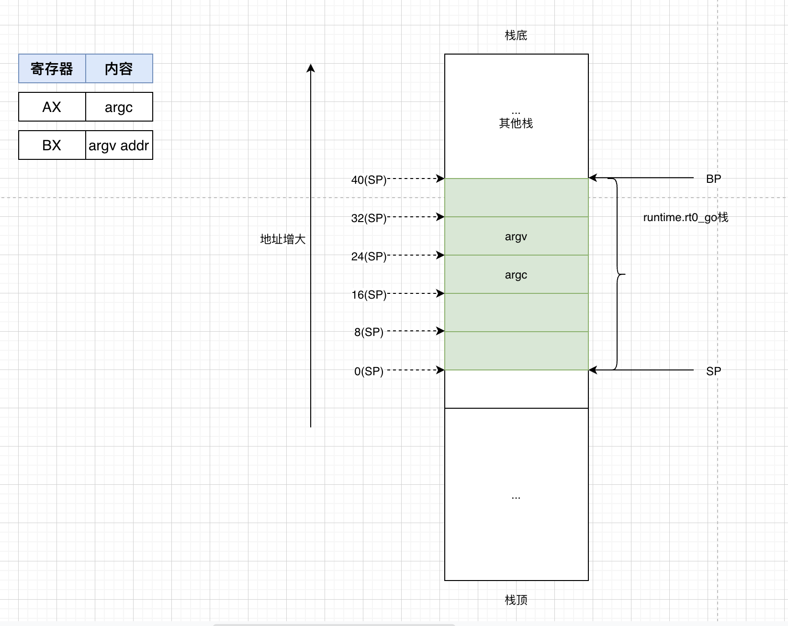
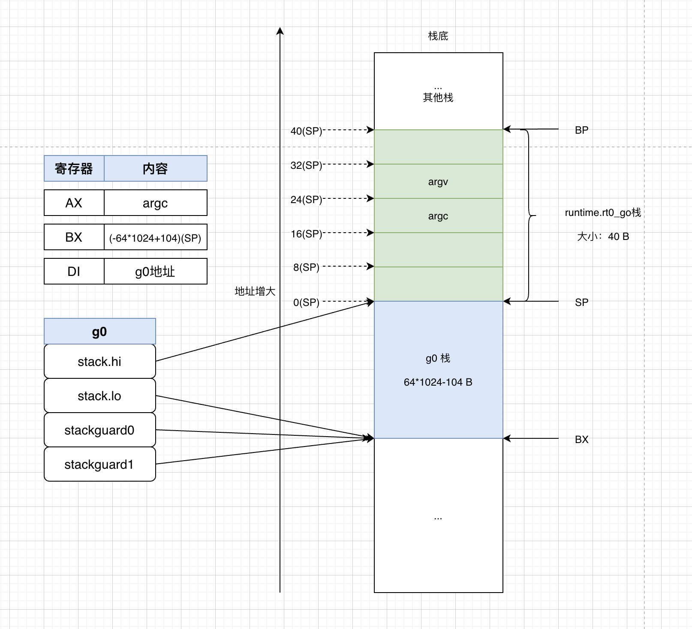
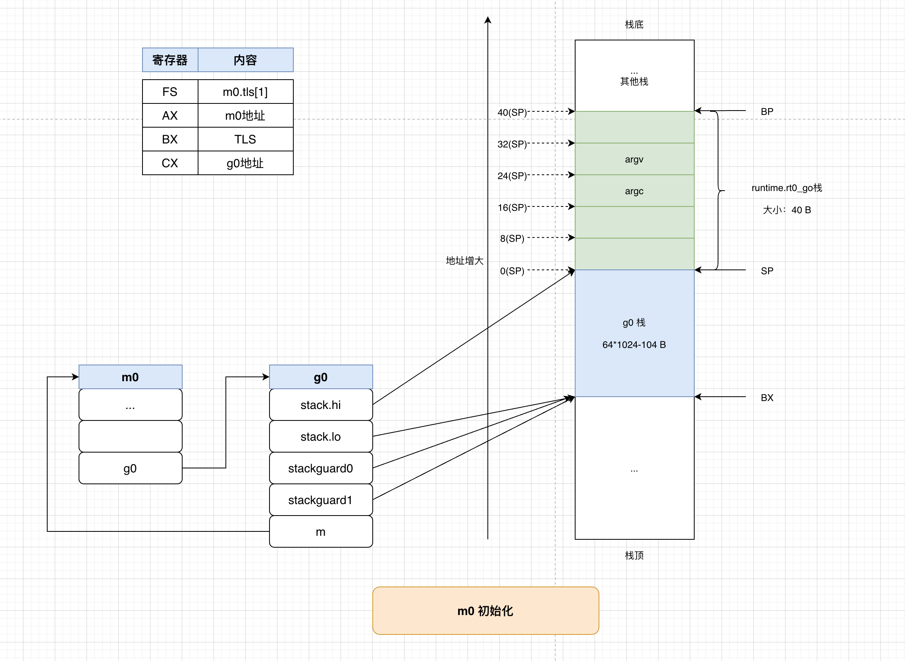

# Go程序的初始化工作


对于用户程序来说，main package中的main()是程序的入口函数。

```go
package main

func main() {
	println("hello world")
}
```

思考如下问题，

- main()是如何被加载启动？
- 在main()运行前，还做了哪一些初始化工作？


-----

## 分析过程

### 本地环境

- 操作系统：Debian GNU/Linux 8 (jessie)
- Go版本：go version go1.5.4 linux/amd64


首先需要找到整个程序的[entry point](https://en.wikipedia.org/wiki/Entry_point)，然后再梳理对应的流程。


### entry point

查看程序的`entry point`有多个方法，

- 使用`readelf`查看
- 使用调试工具
  - [go-delve/delve](https://github.com/go-delve/delve)
  - gdb


**1、使用`readelf`读取程序的相关信息：**

a. 编译源码：`GOOS=linux GOARCH=amd64 CGO_ENABLED=0 go build -gcflags "all=-N -l" main.go`

b. 使用`readelf -h main`查看相关信息：

  ```bash
# readelf -h main
ELF Header:
  Magic:   7f 45 4c 46 02 01 01 00 00 00 00 00 00 00 00 00
  Class:                             ELF64
  Data:                              2's complement, little endian
  Version:                           1 (current)
  OS/ABI:                            UNIX - System V
  ABI Version:                       0
  Type:                              EXEC (Executable file)
  Machine:                           Advanced Micro Devices X86-64
  Version:                           0x1
  Entry point address:               0x44e3b0
  Start of program headers:          64 (bytes into file)
  Start of section headers:          456 (bytes into file)
  Flags:                             0x0
  Size of this header:               64 (bytes)
  Size of program headers:           56 (bytes)
  Number of program headers:         7
  Size of section headers:           64 (bytes)
  Number of section headers:         21
  Section header string table index: 6
  ```

其中，`Entry point address`为真正的入口地址。


使用`objdump -S --start-address=0x44e3b0 | more`查看入口函数的指令。

```bash
./main:     file format elf64-x86-64


Disassembly of section .text:

000000000044e3b0 <_rt0_amd64_linux>:
// license that can be found in the LICENSE file.

#include "textflag.h"

TEXT _rt0_amd64_linux(SB),NOSPLIT,$-8
        LEAQ    8(SP), SI // argv
  44e3b0:       48 8d 74 24 08          lea    0x8(%rsp),%rsi
        MOVQ    0(SP), DI // argc
  44e3b5:       48 8b 3c 24             mov    (%rsp),%rdi
        MOVQ    $main(SB), AX
  44e3b9:       48 8d 05 10 00 00 00    lea    0x10(%rip),%rax        # 44e3d0 <main>
        JMP     AX
  44e3c0:       ff e0                   jmpq   *%rax
        ...
```


**2、使用`dlv`查看入口**

或者使用`dlv debug main.go`打开调试，

```bash
# dlv debug main.go

Type 'help' for list of commands.
(dlv) l
> _rt0_amd64_linux() /usr/local/go/src/runtime/rt0_linux_amd64.s:8 (PC: 0x465660)
Warning: debugging optimized function
     3: // license that can be found in the LICENSE file.
     4:
     5: #include "textflag.h"
     6:
     7: TEXT _rt0_amd64_linux(SB),NOSPLIT,$-8
=>   8:         JMP     _rt0_amd64(SB)
     9:
    10: TEXT _rt0_amd64_linux_lib(SB),NOSPLIT,$0
    11:         JMP     _rt0_amd64_lib(SB)
```

其中`rt0`是`runtime0`的缩写。

-----

### _rt0_amd64_linux入口

_rt0_amd64_linux位于`rt0_linux_amd64.s`文件中。

```
TEXT _rt0_amd64_linux(SB),NOSPLIT,$-8
	LEAQ	8(SP), SI // argv
	MOVQ	0(SP), DI // argc
	MOVQ	$main(SB), AX
	JMP	AX
	
TEXT main(SB),NOSPLIT,$-8
	MOVQ	$runtime·rt0_go(SB), AX
	JMP	AX
```

首先，把`argv`数组的地址放在SI寄存器，`argc`参数值放在DI寄存器中，调用`$main`方法。

`$main`方法又调用了`$runtime.rt0_go`方法，该方法内部实际做了初始化的工作。




### 初始化g0

跳转到`runtime.rt0_go`函数：该函数的主要工作是对`g0`协程进行初始化。


```
TEXT runtime·rt0_go(SB),NOSPLIT,$0
	// copy arguments forward on an even stack
	MOVQ	DI, AX		// argc
	MOVQ	SI, BX		// argv
	SUBQ	$(4*8+7), SP		// 2args 2auto
	ANDQ	$~15, SP  // 栈顶寄存器SP 按照16字节对齐
	MOVQ	AX, 16(SP)  // 保存寄存器AX值：argc值
	MOVQ	BX, 24(SP)  // 保存寄存器BX值：argv地址

	// 初始化g0
	// create istack out of the given (operating system) stack.
	// _cgo_init may update stackguard.
	MOVQ	$runtime·g0(SB), DI  // g0的地址放入DI寄存器
	LEAQ	(-64*1024+104)(SP), BX  // BX寄存器的值：SP+(-64*1024+104)
	MOVQ	BX, g_stackguard0(DI)  // g0.stackguard0 = BX的值（即SP+(-64*1024+104)）
	MOVQ	BX, g_stackguard1(DI)  // g0.stackguard1 = BX的值（即SP+(-64*1024+104)）
	MOVQ	BX, (g_stack+stack_lo)(DI)  // g0.stack.lo = BX的值（即SP+(-64*1024+104)）
	MOVQ	SP, (g_stack+stack_hi)(DI)  // g0.stack.hi = SP
```


初始化完后，g0与内存栈的状态如下：




### cgo初始化

g0初始化完成后，接着探测CPU信息、CPU类型、指令集等，接着做cgo相关的初始化，该部分详细的分析暂时忽略，不影响分析初始化流程。

```
// ... 忽略探测CPU信息和指令集
```

接着做cgo初始化，

```
  // 如果存在_cgo_init，调用该函数
  // if there is an _cgo_init, call it.
	MOVQ	_cgo_init(SB), AX
	TESTQ	AX, AX
	JZ	needtls  // JZ：如果为0，表示如果不存在，则忽略下面指令，直接跳到needtls
	
	// ...
	JEQ ok

needtls:
  // ...
```


### 初始化TLS

初始化tls，[线程局部存储 Thread-local storage](https://en.wikipedia.org/wiki/Thread-local_storage)是为每一个线程提供各自的存储。

TLS的对象是跟着线程开始时分配，线程结束后回收，每个线程有各自的独占实例对象。简单说就是各个线程自己的局部变量。


```
needtls:
      // 如果是Plan9, Solaris，则忽略
	// skip TLS setup on Plan 9
	CMPL	runtime·isplan9(SB), $1
	JEQ ok
	// skip TLS setup on Solaris
	CMPL	runtime·issolaris(SB), $1
	JEQ ok

      // 将tls0的地址存入DI
	LEAQ	runtime·tls0(SB), DI
	CALL	runtime·settls(SB)  // 调用settls将tls0参数保存在FS寄存器中。

      // 对tls进行测试，确保正确。
      // 将0x123的值保存到TLS中，然后读取tls0的值，测试比较是否为之前保存的0x123
	// store through it, to make sure it works
	get_tls(BX)
	MOVQ	$0x123, g(BX)
	MOVQ	runtime·tls0(SB), AX
	CMPQ	AX, $0x123
	JEQ 2(PC)
	MOVL	AX, 0	// abort
ok:
      // ...
```

说明：

1. tls0是当前m0线程的的tls变量，为一个数组，长度为8，即tls0中可存放8个地址。

2. `settls`通过调用`arch_prctl`系统调用保存tls0到FS段寄存器中。也即是未来可以通过访问FS段寄存器即可访问tls0。

      ```
      // set tls base to DI
      TEXT runtime·settls(SB),NOSPLIT,$32
            ADDQ	$8, DI	// ELF wants to use -8(FS)

            MOVQ	DI, SI
            MOVQ	$0x1002, DI	// ARCH_SET_FS
            MOVQ	$158, AX	// arch_prctl
            SYSCALL
            CMPQ	AX, $0xfffffffffffff001
            JLS	2(PC)
            MOVL	$0xf1, 0xf1  // crash
            RET
      ```

      runtime.settls定义在`sys_linux_amd64.s`文件中。

      该函数的作用是：将tls0的数组保存在FS中，使用`-8(FS)`可取得tls0中的数据（第2个地址？）。

      其中用到了系统调用，对于系统调用，寄存器的规则如下，

      | RDI    | RSI    | RDX    | R10    | R8     | R9     | RAX                 |
      | :----- | :----- | :----- | :----- | :----- | :----- | :------------------ |
      | 参数一 | 参数二 | 参数三 | 参数四 | 参数五 | 参数六 | 系统调用编号/返回值 |

      在此，

      1. 系统调用：158号，即`arch_prctl`。其作用是设置架构特定的线程状态。

      2. 入参1：`ARCH_SET_FS`，表示设置`FS`寄存器。

      3. 入参2：tls0的首地址+8

      4. 返回值保存在AX寄存器


3. `get_tls`和`g`的函数定义在`runtime/go_tls.h`中。
      ```
      #ifdef GOARCH_amd64
      #define	get_tls(r)	MOVQ TLS, r
      #define	g(r)	0(r)(TLS*1)
      #endif
      ```

上述过程即完成了TLS的初始化工作。


### 绑定m0和g0

初始化TLS后，就开始绑定m0和g0。

```
ok:
	// set the per-goroutine and per-mach "registers"
	get_tls(BX)  // 加载当前线程（即m0）的TLS，即FS段基址到BX寄存器
	LEAQ	runtime·g0(SB), CX  // CX = g0地址
	MOVQ	CX, g(BX)  // 将g0的地址保存到TLS中，即m0.tls
	LEAQ	runtime·m0(SB), AX  // AX = m0地址

	// save m->g0 = g0
	MOVQ	CX, m_g0(AX)
	// save m0 to g0->m
	MOVQ	AX, g_m(CX)

  // 类型检查是否正确
	CLD				// convention is D is always left cleared
	CALL	runtime·check(SB)
```

绑定m0和g0后，g0和m0、寄存器、内存之间的关系更新如下图，




完成g0和m0的初始化操作后，就进入实际的main函数启动。


```
	MOVL	16(SP), AX		// copy argc
	MOVL	AX, 0(SP)
	MOVQ	24(SP), AX		// copy argv
	MOVQ	AX, 8(SP)
	CALL	runtime·args(SB)  // 调用runtime1.go中args()函数：初始化args
	CALL	runtime·osinit(SB)  // 调用os1_linux.go中的osinit()函数：初始化CPU核数。有多少个CPU core，初始化全局变量ncpu。
	CALL	runtime·schedinit(SB)  // 调度系统初始化


	// 下段代码的主要工作是使用newproc创建一个新的goroutine用于运行runtime.main函数
	// 由于newproc的定义：func newproc(siz int32, fn *funcval)
	// 所以，压栈传入runtime.main的函数地址，和对应函数参数的字节大小。
	// 函数的参数是紧挨着函数地址，所以不需要传入第一个参数的地址。在此由于runtime.main函数是没有参数，则直接为0。
	MOVQ	$runtime·mainPC(SB), AX		// entry
	PUSHQ	AX
	PUSHQ	$0			// arg size
	CALL	runtime·newproc(SB)
	POPQ	AX
	POPQ	AX

	// 启动M，进入调度循环状态，程序运行
	// start this M
	CALL	runtime·mstart(SB)

	MOVL	$0xf1, 0xf1  // crash
	RET
```


## 总结

程序在启动的时候，第一个指令地址存放在`entry point`的地方。


初始化过程中，会对2个特殊的对象进行初始化：`g0`、`m0`。

- g0的栈空间大小约为64KB
- 对于每一个OS级别的线程来说，都会使用TLS（thread-local storage）存储g0这个特殊的goroutine信息。
- 由于g0和m0进行了相互绑定，所以也可以通过g0找到对应的m0。


接着就进入了程序启动的流程，对应的流程总结为下列步骤，

1. args：初始化启动参数
2. osinit：初始化处理线程数
3. scheinit：初始化调度系统
4. 创建一个新的G，并入队列
5. runtime.mstart启动M开始运行

