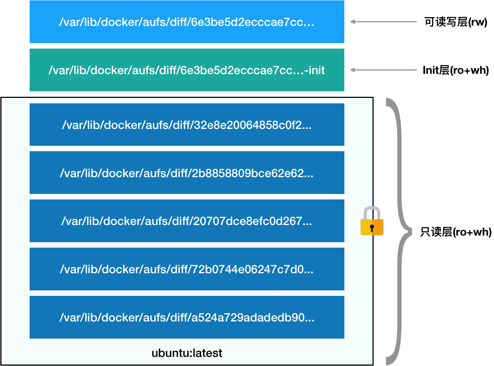

# 深入剖析kubernetes - 学习笔记

本文主要是记录我学习《极客时间》中，对于张磊的《深入剖析kubernetes》这门课程的学习笔记。

## 预习篇 - Docker

### 问题1：遇到什么问题，解决什么问题，如何解决问题？

在云计算中（PaaS），如何打包是一个棘手的问题。

PaaS平台虽然有部署脚本，但是没有解决应用服务对于不同的环境的适配，常常导致对于不同的环境需要：重复打包、重复配置等流程。

Docker的杀手锏特性——Docker镜像。

对于Docker来说，通过系统级别的打包，使用了Cgroups和Namespace进行了隔离，这样就可以使得应用服务的发布变成了批量生成的过程。

但是对于Docker来说没有解决编排、管理的问题，所以就产生了其他的工具，比如：Deis、Flynn、Swarm等等。

**Swarm项目的根本目标：如何让开发者把应用部署在我的项目上。**

### 问题2：如何解决交付

解决了打包问题，但是最终的目标还是把用户的服务使用起来，那么下一个问题就是如何把服务部署到用户的环境中，单机、集群的部署、管理。

- 单机Docker：
    ```
    docker run “我的容器”
    ```

- 多机Docker：
    ```
    docker run -H “swarm address API” “我的容器”
    ```
    
    1. 创建容器的请求会被Swarm拦截下来
    2. 通过具体的调度算法找到合适的Docker Daemon运行起来


Docker中的编排项目（Container Orchestration）：Fig，后改名为Compose。

**Docker运行时：**

- Docker项目的运行时部分：Containerd
- Moby社区维护版本。

**Kubernetes的策略：**

微服务治理：Istio
有状态应用部署框架：Operator


-----


## 白话容器基础

- Docker项目通过“容器镜像”，解决了应用打包这个根本性难题；
- **容器本身没有价值，有价值的是“容器编排”；**


示例：命令：

```bash
docker run -it busybox /binsh
```

其中：`-it参数`：启动容器后，在容器内执行/bin/sh，分配一个文本输入/输出环境，也即是TTY。表示可以和Docker容器进行交互。


**Namespace机制：** Docker在使用`clone()`创建新进程的一个可选参数：`CLONE_NEWPID`。

`int pid = clone(main_function, stack_size, SIGCHLD, NULL); `
变成了
`int pid = clone(main_function, stack_size, CLONE_NEWPID | SIGCHLD, NULL); `

`CLONE_NEWPID`表示：在新进程空间里，PID是1。但在宿主进程空间里，PID还是为真实的数值，比如为100。


**PID Namespace：**使得每个Namespace里的应用进程，都会认为自己是当前容器里的第1号进程。还有Mount、UTS、IPC、Network、User这些Namspace。
所以，容器只是一个特殊的进程而已。


左边是虚拟机的工作原理，右边是容器的工作原理。


在理解了 Namespace 的工作方式之后，你就会明白，跟真实存在的虚拟机不同，在使用 Docker 的时候，并没有一个真正的“Docker 容器”运行在宿主机里面。Docker 项目帮助用户启动的，还是原来的应用进程，只不过在创建这些进程时，Docker 为它们加上了各种各样的 Namespace 参数。

虚拟机和容器的比对：

- 容器的优点：敏捷、高性能

- 虚拟机的优点：隔离彻底


### 容器的隔离

1. 容器只是运行在宿主机上的一个特殊的进程，那么多个容器使用的还是同一个宿主机的操作系统内核。

   容器里通过Mount Namespace单独挂在其他不同版本的操作系统文件，并不能改变宿主机内核的事实。**所以，在Windows宿主机上面运行Linux容器，或者在低版本的Linux宿主机上面运行高版本的Linux容器，都是不行的。**

2. 很多资源和对象不能被Namespace化。最典型的就是：时间。

   比如**settimeofday(2)**系统调用修改时间，整个宿主机的时间就被修改。

   可以使**用Seccomp**等技术，对容器内部发起的系统调用进行过滤，但是问题是：

   	- 无法知道应该开启和关闭哪些系统调用
   	- 多一层系统调用的过滤甄别，一定会拖累容器的性能

   **所以在生产环境，没有人敢把运行在物理机上的Linux容器直接暴露在公网上。**


### 容器的“限制”

Linux Cgroups全称是：Linux Control Group。主要作用是：限制一个进程组能够使用的资源上限，包括CPU、内存、磁盘、网络带宽等等。

还可以对进程进行优先级设置、审计、以及进程挂起和恢复等操作。

每一个docker容器启动的时候，都会在/sys/fs/cgroup/cpu/docker/目录下创建一个容器命名的文件夹，该文件夹下面是对于该容器的“控制组”，配置对于该容器的资源限制文件。


**宿主机上Cgroups DEMO**

1. 运行命令，占满CPU
```bash
while : ; do : ; done &[1] 226
# 该进程PID为226。
```

2. 使用top查看当前CPU占用。由于没有限制，所以当前CPU占用100%

3. 使用Cgroups进行限制CPU：

    - 进入目录/sys/fs/cgroup/cpu/docker，查看当前CPU信息：

    ```
    cat cpu.cfs_quota_us
    # -1。表示，使用CPU配额没有限制。
    ```

    ```
    cat cpu.cfs_period_us
    # 100000：CPU周期定义为100ms
    ```
        
    - 进行修改CPU使用配额：
    ```
    echo 20000 > /sys/fs/cgroup/cpu/docker/cpu.cfs_quota_us
    # 每周期使用20000us（即20ms），也就是占用20%的CPU。
    ```

    - 设置指定的PID进行限制：
    ```bash
    echo 226 > /sys/fs/cgroup/cpu/docker/tasks
    # 之前启动的时候，PID为226。
    ```

    - 查看限制是否生效：`top`


**docker的Cgroups DEMO**

1. 查看CPU周期：
    ```
    cat /sys/fs/cgroup/cpu/cpu.cfs_period_us
    # 默认为100ms（100000us）
    ```

2. 创建一个容器示例：
```bash
docker run -it --cpu-period=100000 --cpu-quota=20000 ubuntu bash
```

    **说明：**
    - cpu-quota参数指定对于一个周期（由--cpu-period）中，多少时间可以使用CPU资源。所以对于上面的示例来说，每个CPU周期，可以用到20%的CPU时间。

    - 在目录/sys/fs/cgroup/cpu/docker中，创建了以docker实例id为文件夹的“控制组”

3. 在容器中，让该容器的CPU跑满：
```bash
while : ; do : ; done &
```

4. 在宿主机上，查看CPU使用情况：top。能看到CPU占用20%。


### 总结

一个正在运行的Docker容器，其实就是启用了多个`Linux Namespace`（CPU、IO等）的应用进程，而这个进程能够使用的资源量，则受到`Cgroups`配置的限制。

所以，**容器是一个“单进程”模型**。

由于容器的本质是一个进程，用户的应用进程实际上就是容器里的`PID=1`的进程，这也就是后续创建的所有进程的父进程。也就意味着，在一个容器中，没有办法运行两个不同的应用，除非能事先找到`PID=1`的程序作为不同应用的父进程。这也是为什么很多人都会使用`systemd`或者`supervisord`替代应用本身作为容器的启动进程。


**Cgroups对资源限制能力的不足**

`/proc`文件系统的问题：

- Linux中`/proc`目录记录当前内核运行状态的一系列特殊文件，查看系统及当前正在运行进程的信息，比如CPU使用情况、内存占用率等，这些也是`top`查看系统信息的主要数据来源：top从`/proc/stat`中获取数据。

- 在容器里执行top指令，显示的是宿主机的CPU和内存数据，而不是当前容器的数据。原因是：`/proc`文件系统并不知道用户通过Cgroups给当前容器做了什么样的资源限制。

> 上述的问题可以借助`lxcfs`解决。
> 由于`top`是从`/proc/stat`下获取数据，所以让容器不挂在宿主机的该目录即可。


### Docker镜像

前面已经提到，对于Docker实例来说，简单来说是一个应用进程。该进程通过Namespace进行各种**隔离**，通过Cgroups进行资源的**限制**。

有个比较特殊的Namespace是文件系统的隔离：使用`Mount Namespace`。需要手动执行触发。`Mount Namespace`是基于对`chroot`的不断改良发明出来的，也是Linux中第一个Namespace。


关于Namespace的详细介绍可以参考改文章：
[左耳耗子 - DOCKER基础技术：LINUX NAMESPACE（上）](https://coolshell.cn/articles/17010.html)


**“容器镜像”**

挂在在容器根目录上，用于为容器进程提供隔离后执行环境的文件系统。也叫做：**rootfs（根文件系统）**。

一般包括：`/bin`, `/etc`, `/proc`等等。


**Docker项目**

最核心的原理就是为待创建的用户进程：

1. 启用Linux Namespace配置；

2. 设置指定的Cgroups参数；

3. 切换进程的根目录（Change Root）；（在该步骤会优先调用pivot_root系统调用）


rootfs只包含文件、配置和目录，不包含操作系统内核。

同一台机器上，所有的容器都共享操作系统的内核。


**依赖库/镜像版本**

对于应用程序来说，操作系统本身才是最完整的“依赖库”。

有了`rootfs`后，我们就可以对应用程序打包一套完整的依赖库环境。解决了完整的依赖问题后，现在需要解决的是该依赖库的版本控制问题。

举例来说，但对于传统的依赖库环境来说，v1.1是基于v1.0版本修改而成，v1.0版本和v1.1版本都具备完整的环境，它们之间没有太多的联系。未来出现v1.2版本后，经过少量修改后，又得生成一套全新的依赖库。那么，解决方法就是希望每次只需要维护修改的增量内容，而不是每次重新创建一个全新、完整的依赖库。

为此，引入了`layer`。每一步操作，会生成一个层，也即是增量rootfs。为此引入“联合文件系统（Union File System）”，UnionFS。


`AuFS`: Another UnionFS，又改名为：Alternative UnionFS，最后改为：Advance UnionFS

- 是对Linux原生UnionFS的重写和改进；

- 只能在Ubuntu和Debian发行版上使用；


对于AuFS，最关键的目录结构是在：`/var/lib/docker`下的diff目录：

```
/var/lib/docker/aufs/diff/<layer_id>
```


“镜像”实际上就是操作系统的rootfs，内容就是操作系统的所有文件和目录。不同的是：往往由多个“层layer”组成。

使用命令可以查看，

```bash
docker image inspect ubuntu:latest

//...
        "RootFS": {
            "Type": "layers",
            "Layers": [
                "sha256:918b1e79e35865cfaa7af9e07fa2a7aaaa2885e6bee964691a93c5db631b0aff",
                "sha256:83b575865dd109e77301a1be1e510cfffa6b89b9ff6355df22b5008315778263",
                "sha256:153bd22a8e96919e8eb890cc50aba51d7c16ea0746c2f020f21312f88e65f5c8",
                "sha256:ca893d4b83a60ef4e859785bc6b4072242ae07c7d6d0a07098847bc281b525b8",
                ...
            ]
        },
// ...
```


**查看AuFS挂在信息**

```bash
$ cat /proc/mounts| grep aufs
none /var/lib/docker/aufs/mnt/6e3be5d2ecccae7cc0fc... aufs rw,relatime,si=972c6d361e6b32ba,dio,dirperm1 0 0
```

会获得AuFS的内部ID，即si=972c6d361e6b32ba。使用该ID，可以在/sys/fs/aufs查看联合挂载的信息。

```bash
$ cat /sys/fs/aufs/si_972c6d361e6b32ba/br[0-9]*
/var/lib/docker/aufs/diff/6e3be5d2ecccae7cc...=rw
/var/lib/docker/aufs/diff/6e3be5d2ecccae7cc...-init=ro+wh
/var/lib/docker/aufs/diff/32e8e20064858c0f2...=ro+wh
/var/lib/docker/aufs/diff/2b8858809bce62e62...=ro+wh
/var/lib/docker/aufs/diff/20707dce8efc0d267...=ro+wh
/var/lib/docker/aufs/diff/72b0744e06247c7d0...=ro+wh
/var/lib/docker/aufs/diff/a524a729adadedb90...=ro+wh
```


`rootfs`的结构说明：




1. 只读层：以增量方式包含操作系统的一部分。

    对应的是镜像的Layers，挂在方式是只读的（ro+wh，即readonly+whiteout）。可以去对应的路径下查看层的内容：`/var/lib/docker/aufs/diff/{sha256}`。

2. 可读写层：挂在方式：rw，即read write。

    在没有读写操作之前，该目录是空的。读写操作会在该层以增量方式生成文件。如果是删除操作，则创建一个whiteout文件，把只读层里的文件“遮挡”起来。

    `docker commit`会提交该层的修改。

3. init层：Docker项目单独生成的一个内部层，存放`/etc/hosts`、`/etc/resolv.conf`等信息。

    `docker commit`不会包含该层。


**总结**

1. 容器镜像，也叫做`rootfs`。只是操作系统的所有文件和目录，不包含内核。

2. 文件系统的隔离：使用`Mount Namespace`和`rootfs`，并使用`chroot`和`pivot_root`两个系统调用切换进程根目录。

3. 镜像的增量修改引入了`Layer`的概念。

    UnionFS的实现：aufs、device mapper、btrfs、overlayfs、vfs、zfs。

    aufs是ubuntu常用，device mapper是centos常用，btrfs是SUSE，overlayfs ubuntu和centos都会用。

    最新的Docker版本，Ubuntu、CentOS都使用overlayfs。


### 重新认识Docker容器

**Dockerfile**

使用`Dockerfile`制作容器镜像。

Dockerfile的设计思想：使用一些标准的原语（即大写高亮的词语），描述我们所构建的Docker镜像。按照顺序执行处理的。

基本原语介绍：

- FROM：指定基础镜像
- RUN：容器内执行shell命令
- WORKDIR：修改当前目录
- CMD：指定容器中的进程
- ENTRYPOINT：CMD的内容为ENTRYPOINT的参数。完整的进程执行格式是："ENTRYPOINT CMD"。默认Docker会提供隐含的ENTRYPOINT，即：`/binsh -c`。


**Docker Image**

使用`docker build`制作这个镜像。

```bash
# -t 指定Tag名字
docker build -t helloworld .
```

**Dockerfile的每个原语执行后，都会生成一个对应的镜像层。**


使用`docker image ls`查看编译结果。

使用`docker run`启动容器。

```bash
# 将容器实例的80端口映射到4000端口
docker run -p 4000:80 helloworld
```

使用`docker ps`查看运行实例。


**Docker Hub**

分享容器的镜像到Docker Hub。

1. 注册Docker Hub账号，使用`docker login`登陆；

2. docker tag起一个完整的名字：

    ```bash
    # geektime 镜像仓库（Repository），也即为账号名称
    docker tag helloworld geektime/helloworld:v1
    ```

3. 上传

    ```bash
    docker push geektime/helloworld:v1
    ```


**docker commit 提交修改**

使用`docker commit`修改正在运行的镜像，提交为一个镜像。

```bash
# ... 修改容器镜像内的内容

# 提交镜像保存
docker commit instance01 geektime/helloworld:v2
```


**docker exec的原理**

`docker exec`是在容器中运行的，其工作原理是：一个进程，选择加入某个进程已有的Namespace，即达到了“进入”这个进程所在容器的目的。

使用`setns()`的Linux系统调用可以进行Namespace的切换。


如何查看所在容器的Namespace：

1. 查看实例的在系统的Pid

    ```bash
    docker inspect --format '{{ .State.Pid }}' fed70e1f6d0c
    # 5843
    ```

2. 宿主机查看对应的Namespace文件：

    ```bash
    ls -l /proc/5843/ns

    lrwxrwxrwx 1 root root 0 Aug 30 05:07 cgroup -> 'cgroup:[4026531835]'
    lrwxrwxrwx 1 root root 0 Aug 30 05:05 ipc -> 'ipc:[4026532642]'
    lrwxrwxrwx 1 root root 0 Aug 30 05:05 mnt -> 'mnt:[4026532640]'
    lrwxrwxrwx 1 root root 0 Aug 30 05:05 net -> 'net:[4026532645]'
    lrwxrwxrwx 1 root root 0 Aug 30 05:05 pid -> 'pid:[4026532643]'
    lrwxrwxrwx 1 root root 0 Aug 30 05:07 pid_for_children -> 'pid:[4026532643]'
    lrwxrwxrwx 1 root root 0 Aug 30 05:07 user -> 'user:[4026531837]'
    lrwxrwxrwx 1 root root 0 Aug 30 05:05 uts -> 'uts:[4026532641]'
    ```


使用`docker run -net`启动参数可以指定Network Namespace。

- `-net container:{container_id}` 加入到另一个容器的Network Namespace
- `-net host` 加入到宿主机的Network Namespace


**Docker Registry**

企业内部类似于`Docker Hub`的镜像维护系统。


**Docker Volume 数据卷**

WHY：由于使用了`rootfs`机制和`Mount Namespace`，从而构建了一套与宿主机隔离的文件系统环境。从而遇到新问题：

1. 容器里面的新建文件，如何让宿主机获取？

2. 宿主机上面的文件和目录，如何让容器的进程访问？

WHAT：Docker Volume要解决的问题：`Volume机制`，允许挂载宿主机的目录文件到容器中。

```bash
# 如果没有指定，则宿主机会创建临时文件挂载：/var/lib/docker/volumes/[VOLUME_ID]/_data
docker run -v /test ...

# 指定目录挂载
docker run -v /home:/test ...
```


HOW：

1. 准备好rootfs

2. 挂载宿主机目录到容器目录

3. 执行chroot

备注：

容器进行挂载命令时，容器进程（dockerinit）已经创建。该进程负责：根目录的准备、挂载设备和目录、配置hostname等初始化操作，最后通过`execv()`系统调用，称为PID=1的进程。

挂载技术：绑定挂载（bind mount）机制，允许挂载一个目录或文件，而不是整个设备。

绑定挂载是inode替换的过程。


在容器内，Volume挂载的目录下，新增/修改文件不会被`docker commit`提交掉。但是挂载点的目录由于需要挂载，所以该目录会被创建，但是目录中的文件在宿主机上不会被看到。


**总结**

容器镜像的层次关系：


-----

### Kubernetes的本质

一个“容器”实际上是：由`Linux Namespace`、`Linux Cgroups`和`rootfs`三种技术构建出来的进程的隔离环境。


正在运行的Linux容器：

- 静态视图：容器镜像（Container Image），挂载在`/var/lib/docker/aufs/mnt`上的rootfs。

- 动态视图：容器运行时（Container Runtime），由Namespace + Cgroups构成的隔离环境。


**编排工具**

- Docker Compose + Swarm

- Kubernetes


**Kubernetes解决的问题是什么？**

基于Google “Borg”项目。

提供了不限于下列的能力，

- 编排

- 调度

- 集群管理


**Kubernetes项目架构**


组成节点：

1. Master：控制节点
    
    重要组成组件：

    - kube-apiserver：负责API服务

    - kube-scheduler：负责调度

    - kube-controller-manager：负责容器编排

    整个集群的持久化数据，由kube-apiserver处理后保存在Etcd中。


2. Node：计算节点

    核心部分是：kubelet组件。主要责任：
    
        - 负责通过`CRI（Container Runtime Interface）`的远程接口和容器运行时（Docker项目）打交道。

        - 通过gRPC协议同`Device Plugin`的插件进行交互，来管理GPU等宿主机物理设备的主要组件。

        - 调用网络插件和存储插件为容器配置网络和持久化存储。对应的接口：CNI（Container Networking Interface）和CSI（Container Storage Interface）


**Kubernets的编排优势**

原有的编排服务的不足，比如Docker Swarm+Compose，解决依赖的方法就是把例如IP地址、端口以环境变量的形式注入。

Kubernetes的主要设计思想是：**从更宏观的角度，以统一的方式来定义任务之间的各种关系，并且为将来支持更多种类的关系留有余地。**


- `Pod`是Kubernetes中最基础的一个对象。

- 应用之间的关系，提供了`Service`的服务。

对于之前的不足，做法是：

给`Pod`绑定了一个`Service`服务，Service服务声明的IP地址等信息是“终生不变”。Service服务的主要作用是：**作为Pod的代理入口（Portal），从而代替Pod对外暴露一个固定的网络地址。**


**总结**

- 旧的集群管理工具（比如Yarn、Mesos以及Swarm）所擅长的是`“调度”`，即把一个容器，按照某种规则，放置在某个最佳节点运行起来。

- Kubernetes擅长的是`“编排”`：按照用户的意愿和整个系统的规则，完全自动化的处理好容器之间的各种关系。
