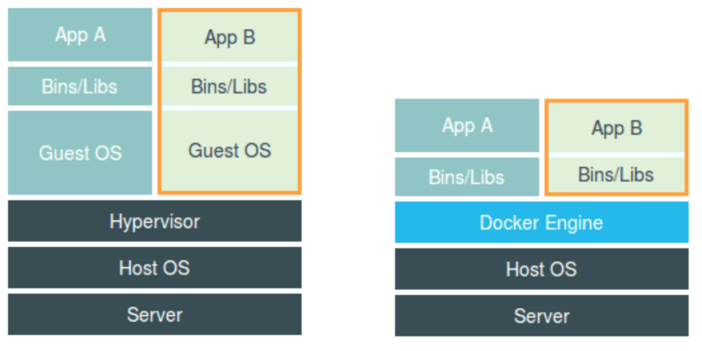

# 深入剖析kubernetes - 学习笔记

本文主要是记录我学习《极客时间》中，对于张磊的《深入剖析kubernetes》这门课程的学习笔记。

## 预习篇 - Docker

### 问题1：遇到什么问题，解决什么问题，如何解决问题？

在云计算中（PaaS），如何打包是一个棘手的问题。

PaaS平台虽然有部署脚本，但是没有解决应用服务对于不同的环境的适配，常常导致对于不同的环境需要：重复打包、重复配置等流程。

Docker的杀手锏特性——Docker镜像。

对于Docker来说，通过系统级别的打包，使用了Cgroups和Namespace进行了隔离，这样就可以使得应用服务的发布变成了批量生成的过程。

但是对于Docker来说没有解决编排、管理的问题，所以就产生了其他的工具，比如：Deis、Flynn、Swarm等等。

**Swarm项目的根本目标：如何让开发者把应用部署在我的项目上。**

### 问题2：如何解决交付

解决了打包问题，但是最终的目标还是把用户的服务使用起来，那么下一个问题就是如何把服务部署到用户的环境中，单机、集群的部署、管理。

- 单机Docker：
    ```
    docker run “我的容器”
    ```

- 多机Docker：
    ```
    docker run -H “swarm address API” “我的容器”
    ```
    
    1. 创建容器的请求会被Swarm拦截下来
    2. 通过具体的调度算法找到合适的Docker Daemon运行起来


Docker中的编排项目（Container Orchestration）：Fig，后改名为Compose。

**Docker运行时：**

- Docker项目的运行时部分：Containerd
- Moby社区维护版本。

**Kubernetes的策略：**

微服务治理：Istio
有状态应用部署框架：Operator


## 白话容器基础

- Docker项目通过“容器镜像”，解决了应用打包这个根本性难题；
- **容器本身没有价值，有价值的是“容器编排”；**


示例：命令：

```bash
docker run -it busybox /binsh
```

其中：`-it参数`：启动容器后，在容器内执行/bin/sh，分配一个文本输入/输出环境，也即是TTY。表示可以和Docker容器进行交互。


**Namespace机制：** Docker在使用`clone()`创建新进程的一个可选参数：`CLONE_NEWPID`。

`int pid = clone(main_function, stack_size, SIGCHLD, NULL); `
变成了
`int pid = clone(main_function, stack_size, CLONE_NEWPID | SIGCHLD, NULL); `

`CLONE_NEWPID`表示：在新进程空间里，PID是1。但在宿主进程空间里，PID还是为真实的数值，比如为100。


**PID Namespace：**使得每个Namespace里的应用进程，都会认为自己是当前容器里的第1号进程。还有Mount、UTS、IPC、Network、User这些Namspace。
所以，容器只是一个特殊的进程而已。



左边是虚拟机的工作原理，右边是容器的工作原理。


在理解了 Namespace 的工作方式之后，你就会明白，跟真实存在的虚拟机不同，在使用 Docker 的时候，并没有一个真正的“Docker 容器”运行在宿主机里面。Docker 项目帮助用户启动的，还是原来的应用进程，只不过在创建这些进程时，Docker 为它们加上了各种各样的 Namespace 参数。

虚拟机和容器的比对：

- 容器的优点：敏捷、高性能

- 虚拟机的优点：隔离彻底


### 容器的隔离

1. 容器只是运行在宿主机上的一个特殊的进程，那么多个容器使用的还是同一个宿主机的操作系统内核。

   容器里通过Mount Namespace单独挂在其他不同版本的操作系统文件，并不能改变宿主机内核的事实。**所以，在Windows宿主机上面运行Linux容器，或者在低版本的Linux宿主机上面运行高版本的Linux容器，都是不行的。**

2. 很多资源和对象不能被Namespace化。最典型的就是：时间。

   比如**settimeofday(2)**系统调用修改时间，整个宿主机的时间就被修改。

   可以使**用Seccomp**等技术，对容器内部发起的系统调用进行过滤，但是问题是：

   	- 无法知道应该开启和关闭哪些系统调用
   	- 多一层系统调用的过滤甄别，一定会拖累容器的性能

   **所以在生产环境，没有人敢把运行在物理机上的Linux容器直接暴露在公网上。**


### 容器的“限制”

Linux Cgroups全称是：Linux Control Group。主要作用是：限制一个进程组能够使用的资源上限，包括CPU、内存、磁盘、网络带宽等等。

还可以对进程进行优先级设置、审计、以及进程挂起和恢复等操作。

每一个docker容器启动的时候，都会在/sys/fs/cgroup/cpu/docker/目录下创建一个容器命名的文件夹，该文件夹下面是对于该容器的“控制组”，配置对于该容器的资源限制文件。


**宿主机上Cgroups DEMO**

1. 运行命令，占满CPU
```bash
while : ; do : ; done &[1] 226
# 该进程PID为226。
```

2. 使用top查看当前CPU占用。由于没有限制，所以当前CPU占用100%

3. 使用Cgroups进行限制CPU：

    - 进入目录/sys/fs/cgroup/cpu/docker，查看当前CPU信息：

    ```
    cat cpu.cfs_quota_us
    # -1。表示，使用CPU配额没有限制。
    ```

    ```
    cat cpu.cfs_period_us
    # 100000：CPU周期定义为100ms
    ```
        
    - 进行修改CPU使用配额：
    ```
    echo 20000 > /sys/fs/cgroup/cpu/docker/cpu.cfs_quota_us
    # 每周期使用20000us（即20ms），也就是占用20%的CPU。
    ```

    - 设置指定的PID进行限制：
    ```bash
    echo 226 > /sys/fs/cgroup/cpu/docker/tasks
    # 之前启动的时候，PID为226。
    ```

    - 查看限制是否生效：`top`


**docker的Cgroups DEMO**

1. 查看CPU周期：
    ```
    cat /sys/fs/cgroup/cpu/cpu.cfs_period_us
    # 默认为100ms（100000us）
    ```

2. 创建一个容器示例：
```bash
docker run -it --cpu-period=100000 --cpu-quota=20000 ubuntu bash
```

    **说明：**
    - cpu-quota参数指定对于一个周期（由--cpu-period）中，多少时间可以使用CPU资源。所以对于上面的示例来说，每个CPU周期，可以用到20%的CPU时间。

    - 在目录/sys/fs/cgroup/cpu/docker中，创建了以docker实例id为文件夹的“控制组”

3. 在容器中，让该容器的CPU跑满：
```bash
while : ; do : ; done &
```

4. 在宿主机上，查看CPU使用情况：top。能看到CPU占用20%。
