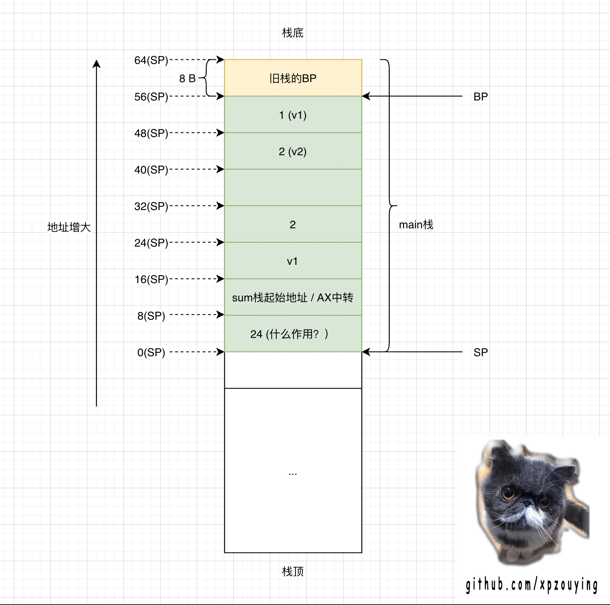

# go func() 是如何新建Goroutine的？

下列程序中，`go func()`背后发生了什么？

```go
package main

func sum(a, b int) int {
	return a + b
}

func main() {
	v1 := 1
	v2 := 2
	go sum(v1, v2)
}
```

-----


## 分析

使用命令生成汇编代码：`GOOS=linux GOARCH=amd64 go build -gcflags "-N -l -S" main.go`


移除部分无效代码后，main函数对应的Go汇编如下，

```
	0x0000 00000 (main.go:7)	TEXT	"".main(SB), ABIInternal, $64-0  // 栈空间为64B，输入参数和返回值为0B
	0x0000 00000 (main.go:7)	MOVQ	(TLS), CX
	0x0009 00009 (main.go:7)	CMPQ	SP, 16(CX)
	0x000d 00013 (main.go:7)	JLS	100
	
	0x000f 00015 (main.go:7)	SUBQ	$64, SP  // 更新SP寄存器，当前栈空间更新为64B
	0x0013 00019 (main.go:7)	MOVQ	BP, 56(SP)  // 保存旧的BP到SP[56, 64]的内存位置
	0x0018 00024 (main.go:7)	LEAQ	56(SP), BP  // 更新56(SP)地址为新的BP寄存器，即栈基寄存器

	0x001d 00029 (main.go:8)	MOVQ	$1, "".v1+48(SP)  // 设置v1
	0x0026 00038 (main.go:9)	MOVQ	$2, "".v2+40(SP)  // 设置v2
	
	
	// 第11行是：go sum(v1, v2)
	0x002f 00047 (main.go:11)	MOVL	$24, (SP)  // 更新24到0(SP)内存位置。（zy: 这个作用是什么？这块内存应该是保存的返回地址，需要确认。）

	0x0036 00054 (main.go:11)	LEAQ	"".sum·f(SB), AX  // 将sum函数的栈起始位置更新至AX。（zy：AX一般是接收函数返回值的）

	0x003d 00061 (main.go:11)	MOVQ	AX, 8(SP)  // 将AX寄存器的值保存到SP[8,16]的内存位置
	0x0042 00066 (main.go:11)	MOVQ	"".v1+48(SP), AX  // v1 --> AX
	0x0047 00071 (main.go:11)	MOVQ	AX, 16(SP)  // AX --> SP[16,24]
	0x004c 00076 (main.go:11)	MOVQ	$2, 24(SP)  // 2 --> SP[24,32]
	0x0055 00085 (main.go:11)	CALL	runtime.newproc(SB)
	
	0x005a 00090 (main.go:12)	MOVQ	56(SP), BP
	0x005f 00095 (main.go:12)	ADDQ	$64, SP
	0x0063 00099 (main.go:12)	RET
	0x0064 00100 (main.go:12)	NOP

	0x0064 00100 (main.go:7)	CALL	runtime.morestack_noctxt(SB)
	0x0069 00105 (main.go:7)	JMP	0

```


从main函数进入初始化，到使用go func()创建协程，main函数的栈如下：




`go sum(v1, v2)`函数位于`main.go:11`，该行被拆解成若干行汇编：

1. main函数的栈空间大小为64B。布局如图所示，其中未标示的空间SP[32,40)，猜测应该是sum返回值的地址，但是使用`go sum()`没法获取sum返回值，因此为空。
2. main函数的局部变量存放在SP[40,56)。
3. SP[0, 8)更新为24。暂时不知道作用，猜测有可能是表示该函数需要使用的栈空间。
4. sum函数的栈起始地址保存在SP[8, 16)，后续看看如何使用。
5. sum函数入参放置在SP[16,32)


使用`CALL runtime.newproc(SB)`创建goroutine。

