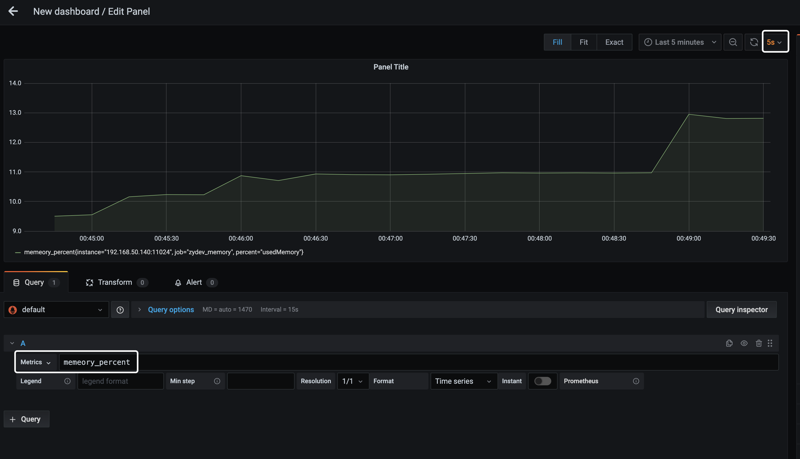

# Prometheus + Grafana

## 启动Prometheus


参考资料：

- [Minimal Prometheus setup](https://dev.to/ablx/minimal-prometheus-setup-with-docker-compose-56mp)


在`docker-compose.yml`文件的目录下，创建文件：`prometheus/prometheus.yml`。配置文件如下，

```yaml
global:
  scrape_interval: 30s
  scrape_timeout: 10s

rule_files:
  - alert.yml

scrape_configs:
  - job_name: services
    metrics_path: /metrics
    static_configs:
      - targets:
          - 'prometheus:9090'
          - 'idonotexists:564'

  - job_name: 'prometheus_demo'

    scrape_interval: 5s

    static_configs:
      - targets: ['192.168.50.140:11024']
```

**说明：**

`job_name`中的`targets`指定去哪个地址取`/metrics`数据。


```bash
docker-compose up -d
```

启动后，测试。

```bash
curl -X POST http://localhost:9000/-/reload
```


```bash
curl http://localhost:9090/api/v1/label/job/values
```


## 启动Grafana


```bash
docker run -d -p 3000:3000 grafana/grafana
```

默认账号密码：admin/admin


## 配置程序

在`prometheus.yml`中，增加新的`job_name`，更新后配置文件如下：


```yaml
global:
  scrape_interval: 30s
  scrape_timeout: 10s

rule_files:
  - alert.yml

scrape_configs:
  - job_name: services
    metrics_path: /metrics
    static_configs:
      - targets:
          - 'prometheus:9090'
          - 'idonotexists:564'

  - job_name: 'zydev_memory'
    scrape_interval: 5s
    static_configs:
      - targets: ['localhost:11024']
```

- `targets: ['localhost:11024']` - HTTP server的端口


```bash
# 请求可以发现配置的jobs_name
curl http://zydev.ts:9090/api/v1/targets
```

## Golang HTTP Server

```go
package main

import (
    "net/http"
    "log"
    "time"
    "os"

    "github.com/prometheus/client_golang/prometheus/promhttp"
    "github.com/prometheus/client_golang/prometheus"
    "github.com/shirou/gopsutil/mem"

)

func main (){
    //初始化日志服务
    logger := log.New(os.Stdout, "[Memory]", log.Lshortfile | log.Ldate | log.Ltime)

    //初始一个http handler
    http.Handle("/metrics", promhttp.Handler())

    //初始化一个容器
    diskPercent := prometheus.NewGaugeVec(prometheus.GaugeOpts{
            Name: "memeory_percent",
            Help: "memeory use percent",
        },
        []string {"percent"},
    )
    prometheus.MustRegister(diskPercent)

    // 启动web服务，监听1010端口
    go func() {
        logger.Println("ListenAndServe at:11024")
        err := http.ListenAndServe(":11024", nil)
        if err != nil {
            logger.Fatal("ListenAndServe: ", err)
        }
    }()

    //收集内存使用的百分比
    for {
        logger.Println("start collect memory used percent!")
        v, err := mem.VirtualMemory()
        if err != nil {
            logger.Println("get memeory use percent error:%s", err)
        }
        usedPercent := v.UsedPercent
        logger.Println("get memeory use percent:", usedPercent)
        diskPercent.WithLabelValues("usedMemory").Set(usedPercent)
        time.Sleep(time.Second*2)
    }
}
```

浏览器打开对应的地址：

```
curl http://localhost:11024/metrics
```

## 配置Grafana

浏览器打开Grafana的地址：

```
http://localhost:3000
```

1、添加`DATA SOURCES` - `Prometheus`

- Name - 起个名字，Memory

- HTTP：

    * URL - http://localhost:9090
    * Access - 访问类型，Browser。从浏览器访问过去的地址。

    或者，

    * URL - http://192.168.1.50:9090
    * Acccess - 访问类型，Server。从Grafana server连接过去的地址。

- 保存。


2、配置

点`菜单` - `Dashboards` - `Manage` - `New Dashboard` - `Add new panel`


选择`Golang`程序中上报的`memory_percent`：

`Query` --> 选项中选择： `Metrics` --> `memory_percent`


3、示例

