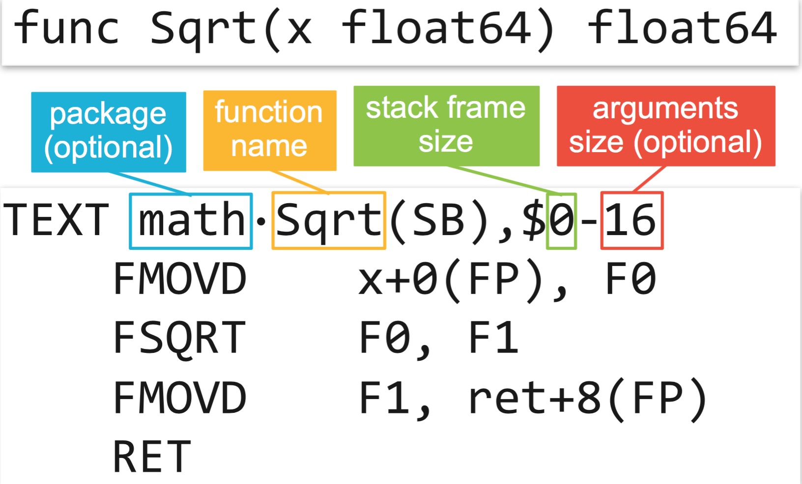
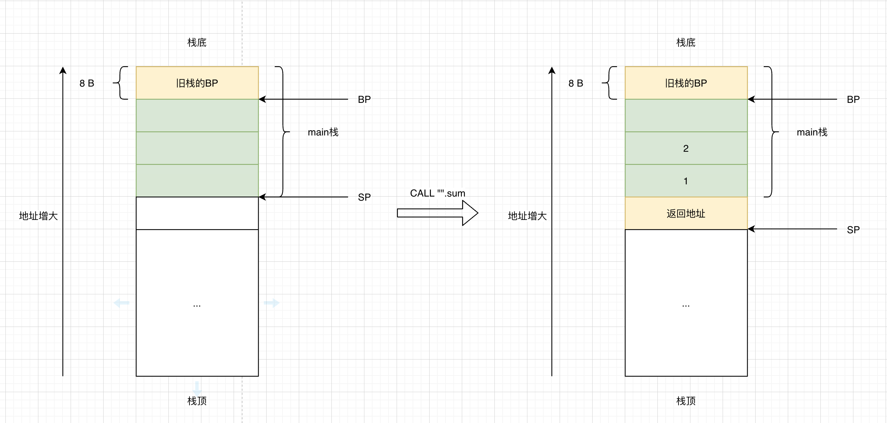
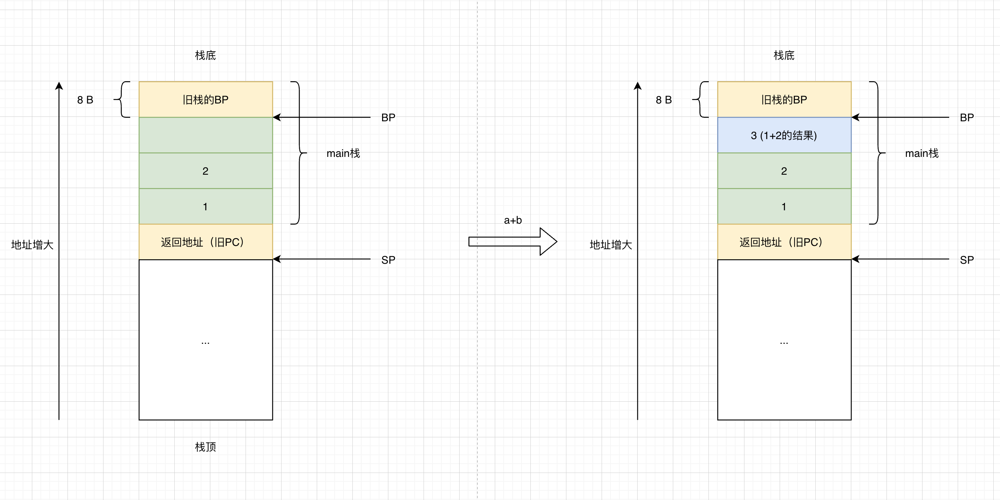
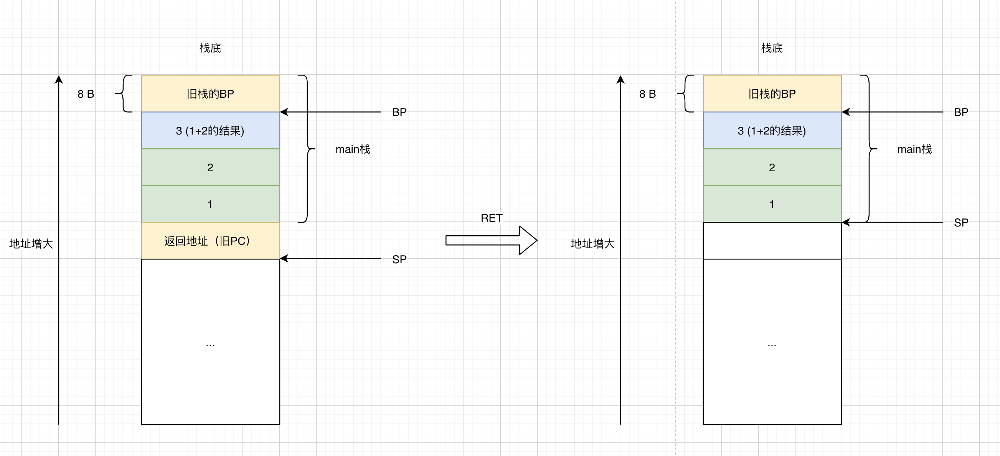

# 调用Go函数时，内存栈发生了什么？

在Go中，函数调用发生时，内存调用栈都发生了什么？

## 示例

```go
package main

//go:noinline
func sum(a, b int) int {
	return a + b
}

func main() {
	a, b := 1, 2
	sum(a, b)
}
```

其中`//go:noinline`编译器指令，禁止内联优化。注意`//`和`go:`之间没有空格。


## 分析

**通过命令生成汇编代码：**

```bash
GOOS=linux GOARCH=amd64 go tool compile -S main.go
```

**输出汇编内容：**


```
"".sum STEXT nosplit size=19 args=0x18 locals=0x0
        0x0000 00000 (main.go:4)        TEXT    "".sum(SB), NOSPLIT|ABIInternal, $0-24
        0x0000 00000 (main.go:4)        FUNCDATA        $0, gclocals·33cdeccccebe80329f1fdbee7f5874cb(SB)
        0x0000 00000 (main.go:4)        FUNCDATA        $1, gclocals·33cdeccccebe80329f1fdbee7f5874cb(SB)
        0x0000 00000 (main.go:5)        MOVQ    "".b+16(SP), AX
        0x0005 00005 (main.go:5)        MOVQ    "".a+8(SP), CX
        0x000a 00010 (main.go:5)        ADDQ    CX, AX
        0x000d 00013 (main.go:5)        MOVQ    AX, "".~r2+24(SP)
        0x0012 00018 (main.go:5)        RET
        0x0000 48 8b 44 24 10 48 8b 4c 24 08 48 01 c8 48 89 44  H.D$.H.L$.H..H.D
        0x0010 24 18 c3                                         $..
"".main STEXT size=71 args=0x0 locals=0x20
        0x0000 00000 (main.go:8)        TEXT    "".main(SB), ABIInternal, $32-0
        0x0000 00000 (main.go:8)        MOVQ    (TLS), CX
        0x0009 00009 (main.go:8)        CMPQ    SP, 16(CX)
        0x000d 00013 (main.go:8)        PCDATA  $0, $-2
        0x000d 00013 (main.go:8)        JLS     64
        0x000f 00015 (main.go:8)        PCDATA  $0, $-1
        0x000f 00015 (main.go:8)        SUBQ    $32, SP
        0x0013 00019 (main.go:8)        MOVQ    BP, 24(SP)
        0x0018 00024 (main.go:8)        LEAQ    24(SP), BP
        0x001d 00029 (main.go:8)        FUNCDATA        $0, gclocals·33cdeccccebe80329f1fdbee7f5874cb(SB)
        0x001d 00029 (main.go:8)        FUNCDATA        $1, gclocals·33cdeccccebe80329f1fdbee7f5874cb(SB)
        0x001d 00029 (main.go:10)       MOVQ    $1, (SP)
        0x0025 00037 (main.go:10)       MOVQ    $2, 8(SP)
        0x002e 00046 (main.go:10)       PCDATA  $1, $0
        0x002e 00046 (main.go:10)       CALL    "".sum(SB)
        0x0033 00051 (main.go:11)       MOVQ    24(SP), BP
        0x0038 00056 (main.go:11)       ADDQ    $32, SP
        0x003c 00060 (main.go:11)       RET
        0x003d 00061 (main.go:11)       NOP
        0x003d 00061 (main.go:8)        PCDATA  $1, $-1
        0x003d 00061 (main.go:8)        PCDATA  $0, $-2
        0x003d 00061 (main.go:8)        NOP
        0x0040 00064 (main.go:8)        CALL    runtime.morestack_noctxt(SB)
        0x0045 00069 (main.go:8)        PCDATA  $0, $-1
        0x0045 00069 (main.go:8)        JMP     0
```

**注意：**

1. 使用该命令生成的汇编为Go特有汇编，不能直接进行运行。

2. 生成的代码中有`FUNCDATA`、`PCDATA`为编译器生成，提供给GC使用。忽略。

3. NOP为占位符，提供给编译器使用。忽略。


### main函数

首先，看main函数，删除无关语句后。

```
        0x0000 00000 (main.go:8)        TEXT    "".main(SB), ABIInternal, $32-0
        0x0000 00000 (main.go:8)        MOVQ    (TLS), CX
        0x0009 00009 (main.go:8)        CMPQ    SP, 16(CX)
        0x000d 00013 (main.go:8)        JLS     64
        0x000f 00015 (main.go:8)        SUBQ    $32, SP
        0x0013 00019 (main.go:8)        MOVQ    BP, 24(SP)
        0x0018 00024 (main.go:8)        LEAQ    24(SP), BP

        0x001d 00029 (main.go:10)       MOVQ    $1, (SP)
        0x0025 00037 (main.go:10)       MOVQ    $2, 8(SP)

        0x002e 00046 (main.go:10)       CALL    "".sum(SB)

        0x0033 00051 (main.go:11)       MOVQ    24(SP), BP
        0x0038 00056 (main.go:11)       ADDQ    $32, SP
        0x003c 00060 (main.go:11)       RET

        0x0040 00064 (main.go:8)        CALL    runtime.morestack_noctxt(SB)
        0x0045 00069 (main.go:8)        JMP     0
```


**初始化**

`func main()`被转换为若干汇编语句，逐行分析。


先看一下Go汇编函数的定义规则。





根据上图中的规则，分析main函数。

```
TEXT    "".main(SB), ABIInternal, $32-0
```

需要关注的是`$32-0`，$32表示当前函数（即main函数）的栈大小，0表示参数的大小，当前为0。


```
MOVQ    (TLS), CX
CMPQ    SP, 16(CX)
JLS     64
```

其中TLS的全称为Thread Local Storage，为每个线程私有的存储空间。后续介绍Goroutine调度时会详细介绍TLS。

这几条命令是从TLS中读取当前线程的寄存器信息，如果当前线程要求的栈空间不够用，则跳转到64行即`CALL runtime.morestack_noctxt(SB)`去申请更多的栈空间。由此也可见，在Go中Goroutine的栈是可动态扩展的。


```
SUBQ    $32, SP
MOVQ    BP, 24(SP)
LEAQ    24(SP), BP
```

其中指令以`Q`结尾，表示操作数为64位，即8字节。

1. 使用SUBQ将栈指针SP向下移动32字节；需要注意栈是从高位向低位扩展。由于SP指向的是“栈顶”，所以向下移动32字节的作用就是对当前栈申请32字节的空间，也对应了上面提到的main函数的栈空间为32字节。
2. 使用MOVQ把当前BP寄存器保存在24(SP)位置上。
   - 24(SP)为SP寄存器当前地址加上24字节。
   - BP寄存器中保存的是栈基地址，当前栈的空间为[BP, SP]之间的空间。
   - 把BP的值保存在SP+24字节的位置，可以看出：a.调用函数时，调用者（即调用main函数的人）的BP寄存器的信息保存在被调用者（即main函数）的栈中；b.当main函数调用完后，退出时，修改BP和SP的寄存器值，即可完成出栈操作。通过不停的修改BP、SP的值就完成了函数栈的变化。
3. 使用LEAQ把24(SP)的地址保存在BP寄存器中。将BP寄存器的值更新为24(SP)地址，完成main函数栈的初始化工作。此时BP、SP寄存器都已经指向至main的栈空间。


当完成main函数初始化后，栈空间的状态如下图所示，每一个表示8字节空间，绿色部分表示main()函数的栈空间。


**调用sum函数**

```
MOVQ    $1, (SP)
MOVQ    $2, 8(SP)
CALL    "".sum(SB)
```

`$`表示立即数，也就是数字。这几条语句就是把1、2两个数字分别赋值到(SP)和8(SP)的地址，并且通过CALL调用sum函数。


为了能够实现函数调用后，能继续之前的操作。CALL指令实际上完成了下列两步操作：

1. PUSH PC：将当前PC寄存器的值保存在栈中。实际上，先让SP扩展了8字节，然后将PC当前的值保存在0(SP)的位置。
2. JMP：跳到sum函数





### sum函数

去掉暂时忽略的语句后，sum函数对应的汇编如下，

```
        0x0000 00000 (main.go:4)        TEXT    "".sum(SB), NOSPLIT|ABIInternal, $0-24
        
        0x0000 00000 (main.go:5)        MOVQ    "".b+16(SP), AX
        0x0005 00005 (main.go:5)        MOVQ    "".a+8(SP), CX
        0x000a 00010 (main.go:5)        ADDQ    CX, AX
        0x000d 00013 (main.go:5)        MOVQ    AX, "".~r2+24(SP)
        
        0x0012 00018 (main.go:5)        RET
```


首先，`$0-24`表示sum的栈空间为0，参数与返回值一共为24字节。


其次，由于之前的CALL指令对SP寄存器做了修改，所以保存a、b的地址分别变成了8(SP)和16(SP)。对这两个值进行ADDQ操作后保存到AX寄存器中，然后放入24(SP)的位置。如下图所示：




最后，调用RET指令，相当于执行了`POP PC`操作。也就是把0(SP)的值重新恢复到PC寄存器中，这样程序就可以按照函数调用前的顺序继续执行。另外SP寄存器也对应的缩小8字节，释放之前临时保存PC的栈空间。




### 返回main函数

结束main函数前，通过更新BP、SP寄存器释放main所占用的栈空间。

```
0x0033 00051 (main.go:11)       MOVQ    24(SP), BP
0x0038 00056 (main.go:11)       ADDQ    $32, SP
0x003c 00060 (main.go:11)       RET
```

首先，将24(SP)地址，即上图中旧栈的BP寄存器恢复到BP中。其次，对SP增加32，缩小32字节，对应的是main函数初始化时扩展的32字节。最后，RET。

