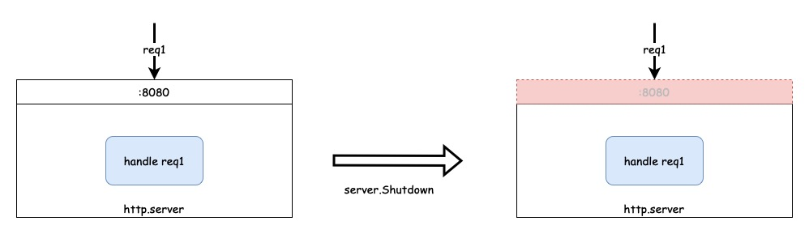

# HTTP服务如何优雅退出和重启

后端服务常常有优雅退出和重启的需求。

分2部分实现：

1. 实现优雅退出。

2. 结合现实的场景，进行优雅重启。

## 优雅退出

### 正常的HTTP Server

为了手动模拟现实情况，在HTTP处理函数中插入了3秒接口处理耗时。

代码在：`./1_normal_server/`目录下。

```go
func main() {
	http.HandleFunc("/", func(w http.ResponseWriter, r *http.Request) {
		time.Sleep(3 * time.Second)

		fmt.Fprintf(w, "hello world")
	})

	log.Fatal(http.ListenAndServe(":8080", nil))
}
```

运行程序：

```bash
# run server
go run .
```

请求服务：

```bash
curl http://localhost:8080
# hello world
```

### 问题

当服务正在处理请求时，当前请求没有结束，直接退出服务会导致客户端接收到下列问题。

```bash
curl http://localhost:8080
# curl: (52) Empty reply from server
```

在发出请求后，立刻在启动服务的命令中按下`ctrl+c`退出。

启动服务的命令会接收到`interrupt`系统信号通知，然后退出。

```bash
go run .
# signal: interrupt
```

### 思路

我们希望把正在进行中的请求处理完后，再退出。那么，

1. 需要能够捕获系统信号通知。

2. 让HTTP Server能够优雅退出。借助[Server.Shutdown](https://pkg.go.dev/net/http#Server.Shutdown)。


### 改造

借助上面的思路，需要进行下列改造。

1. 捕获信号：使用[os.Signal](https://pkg.go.dev/os/signal#Notify)监听interrupt信号（`os.Interrupt`）。

2. 在原有的代码中`http.ListenAndServe`中，会创建一个私有的server，我们无法直接调用对应的`Shutdown`进行退出。
所以需要创建一个新的、显示的Server。

```go
func ListenAndServe(addr string, handler Handler) error {
	server := &Server{Addr: addr, Handler: handler}
	return server.ListenAndServe()
}
```

改动后的代码在`./2_graceful_shutdown/main.go`。

代码解读：

```go
func main() {
	// 定义需要捕获的信号，并且通过channel进行传递。
	c := make(chan os.Signal, 1)
	signal.Notify(c, os.Interrupt) // os.Interrupt = syscall.SIGINT

	http.HandleFunc("/", func(w http.ResponseWriter, r *http.Request) {
		time.Sleep(3 * time.Second)
		fmt.Fprintf(w, "hello world")
	})
	server := &http.Server{
		Addr:    ":8080",
		Handler: nil,
	}
	go func() {
		log.Println(server.ListenAndServe())
	}()

	// 等待接收信号
	s := <-c
	log.Printf("receive signal: %v", s)

	log.Println("http server shutdown: ", server.Shutdown(context.Background()))
}
```

1. 监听`ctrl+c`的系统信号。`os.Interrupt`也就是`syscall.SIGINT`信号。
2. 显示的创建`http.Server`，当接收退出信号，调用`server.Shutdown`进行优雅退出。

[Shutdown函数](https://pkg.go.dev/net/http#Server.Shutdown)在Go1.8版本添加进来。
主要作用是不中断所有正在活动的连接。具体的过程是：

1. 关闭所有的监听（Listener）。

2. 关闭所有的空闲连接（idle connection）。

3. 等待所有的连接变为空闲（idle）状态。

4. 关闭http服务。




点击展开[官方示例](https://pkg.go.dev/net/http#example-Server.Shutdown)。

> ⚠️注意
>
> `log.Println(server.ListenAndServe())`中日志输出函数不能换成：`log.Fatal`。
> 否则，会立刻退出。目前还不知道为什么会导致这个问题。看了Fatal函数的实现，只有一个差别，
> 多了个`os.Exit(1)`。
>
> 猜测：在`os.Exit(1)`中，可能触发了强制退出的某种行为。


## 优雅重启

完成优雅退出后，更进一步，还有一些真实的场景满足不了。在调用`Shutdown`方法后，http server会关闭所有监听，也就表示在上面示例中，此时再有新的请求（假设为request2）到`:8080`，会报错。

```bash
curl http://localhost:8080
# curl: (7) Failed to connect to localhost port 8080: Connection refused
```

虽然此时整个程序还没有退出（还在处理第一次请求），但是http server已经关闭了所有的监听，不在接收新的请求了。

在现实的情况下，常常会遇到这个问题。比如在做CI/CD上线时，旧的服务在退出时，此时线上若是有请求过来后，我们希望同时满足：

1. 老的服务能够处理完之前的请求；

2. 新的服务能够处理新的请求；


### 思路 - 端口复用

如何能同时满足上面2个条件，

1. 使用之前的优雅退出方案能够解决第一个问题；

2. 加入端口复用，将新的请求发送给新服务处理；

详细的流程如下：

假设之前的老服务为server1，新服务名字为server2。

1. 启动server1，监听在`:8080`端口上。

1. 启动server2。使用端口复用，同样会监听在`:8080`端口上。

1. 虽然server1和server2都监听在同样的端口。但是由于server1先进行监听，此时过来的请求request1会交给server1处理。

1. server1按照之前的流程进行优雅退出；此时，server1会关闭对于`:8080`端口的监听，由于request1仍然在处理中，所以server1的进程还未关闭。

1. 新的请求request2过来，由于上一步中server1已经关闭了对于端口的监听，所以会交给server2进行处理。

1. server1处理完request1后退出进程。

有上面的过程就完成了整个服务的优雅重启的流程。

> 端口复用参数的详细说明：[SO_REUSEPORT (since Linux 3.9)](https://man7.org/linux/man-pages/man7/socket.7.html)

